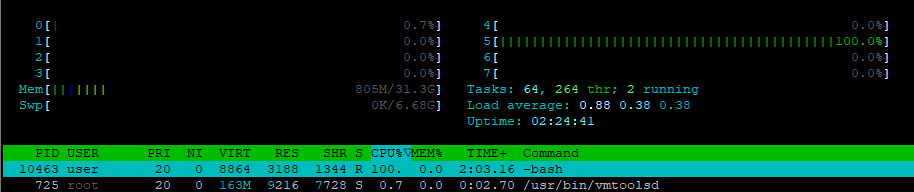

# Scripts
 Scripts para testing de ambientes
 Al momemento solo ambiente linux

### Parallel_process
Genera 32 procesos paralelos para probar multithreading y darle un poco de stress, la idea final es probar al sistema de monitoreo.

Nota: tener instalado: 
parallel (sudo apt install parallel)
o
moreutils (sudo apt install moreutils)

### CPU LOAD
for simple con un while true para manter activo el/los threads que se necesita/n
Nota: Mirar los numeros de procesos que genera por si es necesario matarlos y liberar al CPU

user@docker01:~$ for i in 1; do while : ; do : ; done & done
[1] 10463

user@docker01:~$ kill -9 10463
