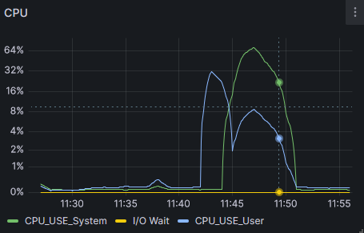

# Scripts
 Scripts para testing de ambientes
 Al momemento solo ambiente linux

### Parallel_process
Genera 32 procesos paralelos para probar multithreading y darle un poco de stress, la idea final es probar al sistema de monitoreo.

Nota: tener instalado: 
parallel (sudo apt install parallel)
o
moreutils (sudo apt install moreutils)

### CPU LOAD
for simple con un while true para manter activo el/los threads que se necesita/n
Nota: Mirar los numeros de procesos que genera por si es necesario matarlos y liberar al CPU

user@docker01:~$ for i in 1; do while : ; do : ; done & done
[1] 10463

user@docker01:~$ kill -9 10463

### Stress
Stress es una herramienta para generar carga en los recursos de la maquina CPU - Mem - I/O

es facil de verlo con el script wathc-it

Ejemplos para realizar la carga
stress --cpu 2 (Para carga de CPU al 2%)
stress --cpu 4 (Para carga de CPU al 4%)

stress --vm 2 (Para carga de Memoria al 2%)

stress --io 4 (Para carga de I/O al 4%)

Nota: En el caso de CPU Load, genera la carga como el usuario, en cambio con Stress se registra la carga como si fuera de procesos de Sistema.
En el grafico se puede percibir la vista de la carga 

